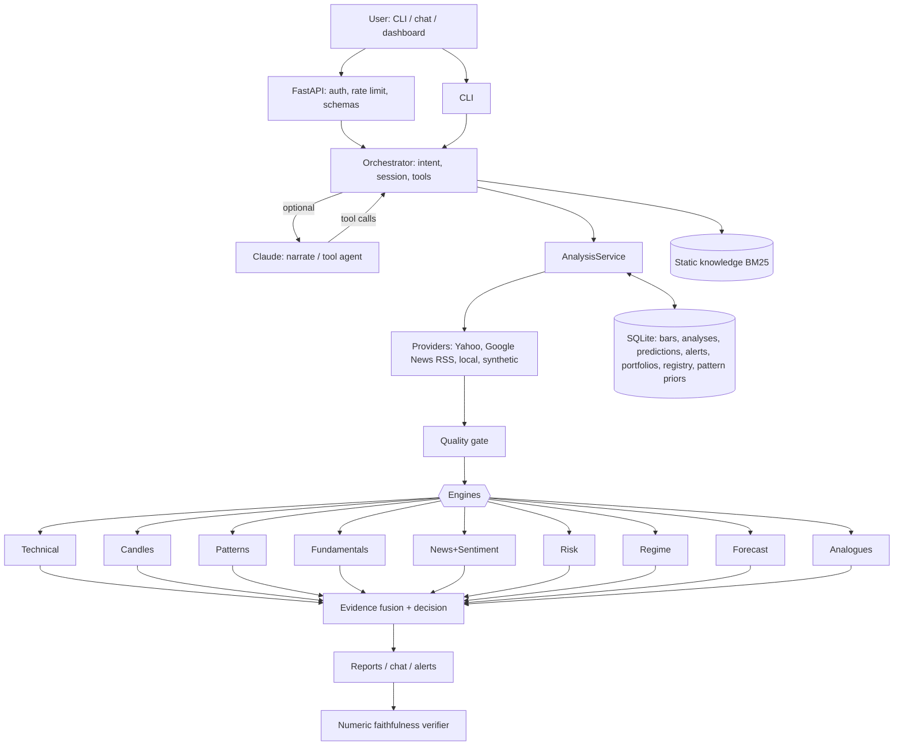
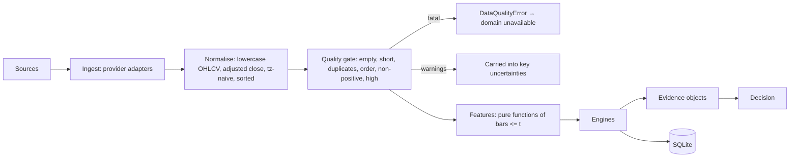
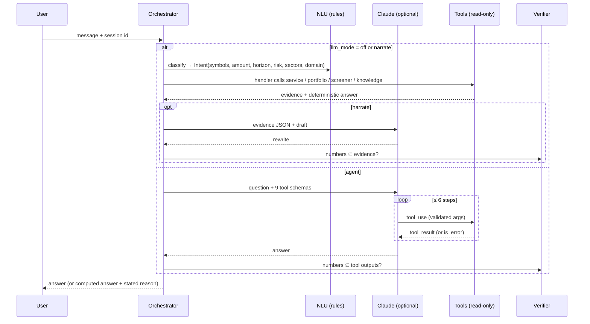
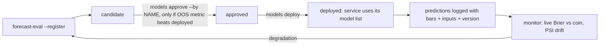

# StockIntel — design specification

Status: MVP built and validated on live NSE data (September 2026); an independent correctness
review found 9 defects, all fixed with regression tests. This document records what the
system is, why each part is shaped the way it is, what was measured, and what is deliberately left
for later. Every numbered value in the code marked PROVISIONAL is listed in §21 with what would
confirm it.

Conventions: *fact* = observed or calculated from reported data; *model output* = a prediction or
classification; *interpretation* = a combination of the two; *decision support* = the label.

---

## 1. Project understanding

Build a personal research analyst for Indian equities that answers questions like "Analyze
RELIANCE", "Why?", "Compare it with HDFC Bank", "I have ₹50,000 — what should I research?" and
"Which holding drives my portfolio risk?" by:

1. computing evidence with specialised, testable engines;
2. fusing it into a decision-support classification that keeps disagreement visible;
3. explaining it in plain language without ever inventing a figure.

The core thesis to test: *can several specialised analytical components combine into a useful,
transparent assistant?* A second, equally important question: *where do they add value over simple
baselines, and where do they not?* §17 answers that with measurements.

## 2. Functional requirements (and where they live)

| Requirement | Implementation |
|---|---|
| Market data, adjusted OHLCV, benchmarks, multi-market config | `data/yahoo.py`, `data/provider.py`, `config.MARKETS` (NSE, BSE, US) |
| Data validation (gaps, duplicates, splits, staleness) | `data/quality.py` — fatal errors raise, soft issues become visible uncertainties |
| Technical analysis → structured observations | `analysis/technical.py`, `analysis/indicators.py` |
| Candlestick recognition with context and historical validation | `analysis/candlesticks.py`, `analysis/validation.py` |
| Chart patterns, structure events, historical validation | `analysis/patterns.py` (causal replay), pooled priors in SQLite |
| Fundamentals, valuation, company profile | `analysis/fundamentals.py` |
| News ingestion, dedup, event typing, scope, reliability | `data/rss.py`, `analysis/news.py` |
| Financial sentiment, recency/credibility weighting, shift detection | `analysis/sentiment.py`, `analysis/news.py` |
| Quant risk: returns, vol, drawdown, beta/alpha, VaR/CVaR, ratios, dependence | `analysis/quant.py` |
| Regime detection | `analysis/regime.py` (trend, vol percentile, variance ratio, filtered HMM) |
| Forecasting with walk-forward validation | `analysis/forecast.py` |
| Historical analogues | `analysis/analogues.py` |
| Evidence fusion, conflict handling, labels | `fusion.py` |
| Portfolio: P/L (FIFO), allocation, exposure, concentration, risk contribution, what-if | `portfolio.py` |
| Budget-aware screening and criteria queries | `screener.py` |
| Chat with session memory, NL → structured operations | `nlu.py`, `orchestrator.py` |
| Generative explanation + tool agent, verified | `llm.py` |
| Static knowledge (RAG), separated from live data | `knowledge.py`, `knowledge_base/*.md` |
| Reports (18 sections), alerts with reasons | `report.py`, `alerts.py` |
| Backtesting with costs, next-open fills, stops, baselines | `backtest/` |
| Model registry, controlled promotion, prediction log, drift | `registry.py`, `storage.py`, `monitoring.py` |
| API, auth, rate limit, dashboard | `api.py`, `web/index.html` |

## 3. Non-functional requirements

| Property | Target | How it is met |
|---|---|---|
| Faithfulness | No figure without a source | Engines are the only number producers; LLM output is number-verified (§9) |
| Provenance | Every claim traceable | `Evidence.provenance` = source, as-of, retrieval time, period |
| Leakage safety | No future information in any historical test | Next-open fills, causal features, purged walk-forward, truncated-history replay (§16) |
| Latency | Single-stock analysis < 10 s live | Measured 3.7–5.6 s (network-bound); cached follow-ups ~0 s |
| Offline operation | Tests and demo need no network | `LocalProvider`, `SyntheticProvider`; 182 tests in ~5 s |
| Failure visibility | Missing data never silently defaulted | `unavailable()` results carry reasons into the decision's uncertainties |
| Reproducibility | Predictions re-runnable | Bars + inputs + model version stored per prediction |
| Security | No secrets in prompts; authenticated API | Env-based keys; constant-time key check; LLM sees evidence only |

## 4. System architecture

**Decision: modular monolith with clean service boundaries.**
Why: one user, one machine; every engine is a pure function over data, so boundaries are already
enforced by interfaces. Alternatives: microservices per engine; a notebook collection. Trade-off:
no independent scaling, which a personal system does not need. Failure: tight coupling creeping
in. Validation: engines import nothing above `analysis/`; the service is the only composition point.

## 5. Component decomposition

Every engine returns a `DomainResult`: `state`, `score ∈ [−1, 1]`, `confidence ∈ [0, 1]`,
`evidence[]` (each with direction, strength, provenance, FACT/MODEL flag), `details`, `error`.
`confidence = 0` means "ran, found nothing to say" and is excluded from the vote rather than
counted as neutral.

| Engine | Method | Confidence comes from | Known limitations |
|---|---|---|---|
| Technical | SMA/EMA/WMA, Wilder RSI/ATR (SMA-seeded, pinned to hand-computed values), MACD, stochastic, Bollinger, OBV, A/D, volume ratio, swing structure, clustered S/R, breakout with volume confirmation, extension in ATRs | Always 1 if data suffices | Thresholds are textbook (70/30 etc.), not tuned |
| Candlesticks | Vectorised detection of 15 formations with prior-trend conditions; context = volume, S/R proximity, next-bar confirmation; per-stock event study, pooled prior fallback | Sum of context-weighted strengths × historical edge multiplier | No formation showed edge (§17) — weights are small by design |
| Chart patterns | Alternating swing pivots → double/triple tops/bottoms, (inverse) H&S with sloped neckline, triangles, wedges, channels, rectangles, broadening, flags/pennants, rounding; structure events incl. false breakouts; causal replay every 5 bars for validation | Pattern confidence × completion × edge multiplier | Numeric only; vision track in §8 |
| Fundamentals | Ratios recomputed from statement line items (growth, margins, ROE/ROA/ROIC, D/E, coverage, current ratio, FCF, P/E, FCF yield); provider snapshot for P/B, EV multiples, PEG; sector-aware (lenders skip leverage ratios); mixed-currency guard | Share of metrics computable | Annual + latest-quarter only; no point-in-time history; absolute valuation bands, not sector-relative |
| News + sentiment | Dedup (token Jaccard ≥ 0.6), 15 event types, scope (company/sector/macro/market), source reliability table, weight = recency (3-day half-life) × reliability × relevance × importance × scorer confidence × sub-linear syndication; 7-day vs 8–30-day shift | Total fresh relevant weight | Lexicon baseline; FinBERT hook not yet evaluated |
| Risk | CAGR, vol, downside dev, max/current drawdown with dates, Sharpe/Sortino/Calmar, historical VaR/CVaR, beta/alpha/R², rolling correlation, skew/kurtosis, autocorrelation, vol clustering, variance ratio | 1 | Uses loaded history (default 5 y) |
| Regime | Trend (price vs rising/falling 200 DMA), vol percentile, Lo-MacKinlay VR(10) with robust z, 2-state Gaussian HMM (filtered probabilities), benchmark risk-on/off | 1 if any regime evidence | HMM parameters fit on full history (filtering itself is causal) |
| Forecast | P(up over h) via climatology, L2 logistic (numpy IRLS), shallow GBM; expanding walk-forward, retrain every 21 bars, purge `t + h < test start`; EWMA range | Brier-skill-scaled; 0 unless it beats climatology out of sample | Per-stock training; see §17 |
| Analogues | kNN on standardised state vector; excludes last 60 bars; de-clustered; outcome vs unconditional with z-test | 1 only if significant | Same-stock only |

## 6. Data architecture

- **Provenance** on every evidence item: `source` (e.g. `yahoo:RELIANCE.NS:income_stmt`,
  `computed:rsi(14)`, `model:forecast:logistic:h5`), `as_of`, `retrieved_at`, `period`.
- **Corporate actions**: adjusted prices from the provider; a > 40% one-day move is flagged as a
  probable unadjusted action, never silently accepted.
- **Currency integrity**: when `financialCurrency ≠ currency` (e.g. Infosys: USD statements, INR
  price), price-based ratios are not recomputed; the provider's own figure is used and labelled.
  Found on live data: INFY's naive P/E came out as 1,250.
- **Staleness**: bars older than 7 days mark the analysis stale; fusion raises uncertainty.
- **Trading calendar**: taken from observed sessions rather than a hard-coded holiday list (no
  fabricated calendar); `exchange_calendars` can be added for forward-looking scheduling.

## 7. Data-source strategy

| Need | Used now | Why | Upgrade path | Caveat |
|---|---|---|---|---|
| NSE/BSE daily bars, indices | Yahoo Finance via `yfinance` | Free, adjusted, `.NS`/`.BO` coverage | NSE bhavcopy archives; broker APIs (Upstox, Angel One SmartAPI, Dhan, ICICI Breeze; Kite Connect is paid) | Unofficial API; terms of use restrict redistribution — personal use only |
| Statements, snapshot ratios | Yahoo | Annual + quarterly statements, consolidated | Exchange XBRL filings; licensed vendors | No point-in-time history; restatements overwrite |
| News | Yahoo news + Google News RSS (`en-IN`) | Broad Indian press coverage | NSE/BSE corporate-announcement feeds (primary source) | Headlines only; publisher terms apply |
| Calendar | Yahoo `calendar` | Earnings / ex-dividend dates | Exchange board-meeting intimations | Sometimes missing |

Anything a provider cannot supply raises `DataUnavailable`; the domain reports "Data unavailable"
with the reason. Provider pricing and terms change — verify before relying on any paid feed.

## 8. Model strategy

| Layer | Decision | Why | Alternatives considered | Validation |
|---|---|---|---|---|
| Deterministic | All indicators, ratios, portfolio maths, risk statistics, backtests | Exact and testable; an LLM adds only error | LLM arithmetic (rejected outright) | Known-value tests (RSI pinned to hand-derived Wilder values) |
| Classical/statistical | Event studies, variance ratio, HMM, EWMA vol, kNN analogues | Interpretable, cheap, well-understood failure modes | Deep sequence models | Walk-forward and pooled event studies |
| ML (Layer C) | Logistic and shallow GBM for direction probabilities; lexicon sentiment | Small data per stock; must beat climatology to count | Time-series foundation models (Chronos/Chronos-Bolt, TimesFM, Moirai, TimeGPT; Kronos for K-line data); FinBERT | Pluggable `forecast.MODELS` / `sentiment.Scorer`; same walk-forward gate before adoption |
| Generative (Layer A/B) | General frontier model (Claude) with tools + retrieval; no fine-tuning | Facts must come from tools regardless; retrieval covers definitions; fine-tuning would bake stale facts into weights | Finance-specific LLMs (BloombergGPT, FinGPT/FinMA); LoRA on research notes | Faithfulness verifier on every reply; an eval of explanation quality is the next step (§17) |
| Vision | Not in the MVP | Textbook patterns showed no edge numerically; image classification of the same patterns cannot add edge that is not there | CNNs on chart images: Jiang, Kelly & Xiu (2023, *Journal of Finance*) found learned image representations carried return information for US stocks — the promising variant is a learned model, not a textbook-pattern classifier | Would have to beat the numeric detectors and the base rate in the same pooled, purged evaluation |

## 9. Agent / orchestration architecture

- **Tools** (`Orchestrator.agent_tools`): `analyze_stock`, `domain_evidence`, `compare_stocks`,
  `screen_budget`, `research_query`, `portfolio`, `portfolio_what_if`, `explain_move`,
  `explain_concept`. All read-only; no tool can place orders or call external write APIs.
- **Validation**: JSON schemas on the Claude side; `SYMBOL_RE`, domain enums and positive-amount
  checks on the server side; unknown tools return `is_error`.
- **Failure behaviour**: tool exceptions become `is_error` results the model can react to; an
  unreachable/refusing/unfaithful model returns the rule-based answer plus one sentence saying
  which happened. Nothing fails silently.
- **Timeouts/retries**: provider fetches run in a pool with a 25 s timeout; the Anthropic SDK
  retries 408/409/429/5xx twice; the agent stops after 6 tool steps.
- **Session**: last symbols (a comparison keeps the conversation's subject as "it"), cached
  analyses (15 min), horizon, risk profile, agent transcript.
- **Why rule-based NLU by default**: 20-odd well-defined intents; rules are exact, instant, free
  and testable (18 intent tests). The agent covers phrasings the rules miss.

## 10. RAG architecture

- Corpus: `knowledge_base/*.md` — indicators, candlesticks, chart patterns, fundamentals, risk
  metrics, methodology, Indian market basics. 65 section-level chunks.
- Retrieval: BM25 with light stemming and finance synonyms (`pe → p/e`, `ltcg → long-term capital
  gains tax`). Why not embeddings: a small definitional corpus where exact terms dominate; BM25
  needs no model or vector store. Switch only if a retrieval eval on real questions shows misses.
- Answers cite `knowledge_base/<file> § <section>` and state "Contains no live market data".

## 11. Knowledge architecture: static vs dynamic

| Static (knowledge base) | Dynamic (engines + providers) |
|---|---|
| "What is RSI?", "What does debt/equity mean?", "What is a Sharpe ratio?" | "What is TCS's RSI today?", "What changed at Reliance this week?" |
| Timeless definitions, methodology, tax rules flagged "verify current rules" | Timestamped, sourced, recomputed each analysis |

The router sends a concept question with a live marker ("current", "today", "my", a ticker) to
the engines; "Why is *this* P/E expensive?" is answered by both (concept + the stock's live figures).

## 12. Database schema

Implemented (SQLite, WAL, foreign keys on):

| Table | Key | Purpose |
|---|---|---|
| `ohlcv` | (symbol, date) | Bars used by analyses, with source and retrieval time |
| `analyses` | id; index (symbol, analysis_ts) | Full analysis payloads — "what changed", alerts |
| `predictions` | id; index (symbol, as_of) | Model, version, horizon, input hash, output, realized outcome |
| `reports` | id | Generated research reports |
| `alerts` | id | Kind, severity, message, reasons, acknowledged |
| `portfolios` | id, unique name | Cash, risk profile, horizon |
| `transactions` | id → portfolio | The only source of positions (FIFO), with CHECK constraints |
| `portfolio_snapshots` | id → portfolio | Risk over time (portfolio-risk alerts) |
| `pattern_validation` | (pattern, family) | Pooled event-study priors |
| `model_versions` | (name, version) | Registry with lifecycle status |

Logical model for later growth (not built until needed): `markets`, `exchanges`, `securities`
(with ticker history), `companies`, `financial_statements` (point-in-time with `reported_at`),
`corporate_actions`, `news_articles` ↔ `news_events`, `knowledge_documents`. Positions are
deliberately not a table: they would duplicate transactions.

## 13. API design

All JSON; `X-API-Key` required except `/health` and `/`. Strict JSON (NaN → null).

| Method & path | Returns |
|---|---|
| `GET /search?q=` | Matching tickers |
| `GET /stocks/{t}` | Profile, last close |
| `GET /stocks/{t}/analysis?horizon=` | Full analysis + rendered text |
| `GET /stocks/{t}/{technical,candlesticks,patterns,fundamentals,news,risk,regime,forecast,analogues}` | One domain's result and evidence |
| `GET /stocks/{t}/chart?bars=` | OHLCV, SMA50/200, S/R, patterns |
| `GET /stocks/{t}/backtest` | Strategy comparison table |
| `GET /compare?symbols=A,B` | Side-by-side |
| `GET /screener?budget=&risk_profile=&horizon=&include=&exclude=` | Candidates with reasons, exclusions |
| `GET/POST /portfolio`, `GET /portfolio/{analysis,holdings,risk}`, `POST /portfolio/what-if` | Portfolio |
| `POST /chat {message, session_id}` | Reply with intent, tools used, LLM metadata |
| `GET /reports`, `POST /reports/{t}` | Reports |
| `GET /alerts`, `POST /alerts/{id}/ack` | Alerts |
| `GET /knowledge?q=` | Knowledge passages |

Errors: 400 invalid input, 401 auth, 404 data unavailable (`{"error": "data_unavailable", "detail": …}`),
422 schema/data-quality, 429 rate limit.

## 14. Frontend architecture

One dependency-free HTML file served by the API (works offline; no CDN). Tabs: Analysis, Chat,
Portfolio, Screener, Alerts. Analysis shows the label (status colour + icon + text), score,
confidence, uncertainty, candlestick chart (hollow = up, filled = down, so identity never rests
on red/green), 50/200-day averages in validated categorical colours with direct end labels,
support/resistance, crosshair tooltip, volume, a table view, a diverging domain-vote chart,
supporting/contradicting evidence and the full text. Light and dark palettes validated for colour-
vision deficiency and contrast. All untrusted strings (headlines) are inserted with `textContent`.

## 15. Portfolio architecture

Transactions → FIFO lots → positions (realized P/L exact; an oversell is rejected). Valuation at
last close; unrealized P/L; allocation incl. cash; sector exposure; HHI and effective holdings;
covariance-based volatility with Euler risk contributions (sum to 100%); diversification ratio;
average pairwise correlation; backcast drawdown/VaR/CVaR/beta at current weights (assumption
stated); 5-session change with best/worst contributor; profile limits (position, sector, holding
volatility) as flags; what-if scenarios for new money (whole shares, leftover stays cash).

## 16. Backtesting architecture

- **Execution**: target decided at close *t*, filled at open *t+1*, held open-to-open. A test pins
  that a signal cannot earn the bar that produced it.
- **Costs**: 12 bps brokerage/taxes + 5 bps slippage per unit of turnover (India delivery,
  PROVISIONAL); stop-loss checked on the day's low, gap-through fills at the open; liquidity check
  flags position size above 1% of median traded value.
- **Metrics**: CAGR, total return, Sharpe, Sortino, max drawdown, Calmar, volatility, win rate,
  profit factor, average trade, trade count, turnover, exposure, costs paid.
- **Baselines** with fixed textbook parameters (no tuning, no snooping): buy-and-hold, SMA 50/200,
  126-day time-series momentum, RSI(30/55) mean reversion, Bollinger reversion.
- **Engine replay**: the live technical engine and the price-domain fusion are re-run on truncated
  histories every 5 bars — the backtested logic is the production logic.
- **Walk-forward** for models: expanding window, 21-bar retrain, purge; the audit trail is part of
  the output and tested.
- **Multiple testing**: every comparison prints the best-of-N caveat; pattern studies use
  Bonferroni thresholds.

## 17. Evaluation methodology and measured results

Metrics by task: classification — Brier, Brier skill vs climatology, log loss, AUC, accuracy,
calibration table, AUC split by volatility regime; ranges — empirical coverage; strategies — risk-
adjusted return, drawdown, stability across stocks; patterns — de-clustered event study, excess
over each stock's own mean, pooled across stocks, Bonferroni.

### 17.1 Patterns (48 NSE large caps, 5 years, `validate-patterns --universe`)

~12,000 candlestick events and ~3,000 chart-pattern completions (causal replay). 43 patterns
tested → Bonferroni |z| ≥ 3.25. **None significant.** Largest |z|: rising wedge (up-break)
−2.38 and falling channel (down-break) +2.19 — both *opposite* to the textbook claim — and bullish
harami +2.14, i.e. about the two-to-three false positives chance predicts at z ≥ 2.
Consequence: patterns with ≥ 200 pooled events and no edge carry weight 0.1; each claim states
the pooled result.

### 17.2 Timing strategies (48 stocks, Dec 2022 – Sep 2026, net of costs, `backtest --universe`)

| Strategy | Median CAGR % | Median Sharpe | Mean max DD % | Beats B&H Sharpe |
|---|---|---|---|---|
| Buy and hold | 14.32 | 0.634 | −31.6 | — |
| SMA 50/200 | 5.37 | 0.369 | −28.5 | 9/48 |
| Momentum 126d | 3.42 | 0.280 | −29.4 | 6/48 |
| RSI mean reversion | 1.58 | 0.208 | −16.1 | 15/48 |
| Bollinger reversion | 1.99 | 0.228 | −20.4 | 6/48 |
| Technical engine (replayed) | 2.33 | 0.227 | −25.6 | 14/48 |
| Logistic forecast (p > 0.55) | 0.84 | 0.145 | −31.2 | 7/48 |

Survivorship bias (today's large caps) favours buy-and-hold, so the gap is overstated — but not
reversed. On RELIANCE alone the price-domain fusion replay lost 6.1% a year vs +0.8% for
buy-and-hold. **Conclusion:** the system's value is research synthesis, risk and portfolio
analysis, and honest uncertainty — not market timing. Labels are presented accordingly.

### 17.3 Forecasts (pooled walk-forward, `forecast-eval`)

12 large caps (RELIANCE, HDFCBANK, ICICIBANK, TCS, INFY, ITC, LT, SBIN, BHARTIARTL, MARUTI,
SUNPHARMA, TITAN), expanding walk-forward, ~11,000 out-of-sample predictions per horizon:

| Horizon | Logistic Brier skill | Logistic AUC | GBM Brier skill | GBM AUC |
|---|---|---|---|---|
| 1 day | −0.016 | 0.505 | −0.068 | 0.502 |
| 5 days | −0.048 | 0.504 | −0.146 | 0.494 |
| 20 days | −0.110 | 0.488 | −0.218 | 0.506 |

Neither model beats the climatology base rate; the non-linear model overfits more. The skill gate
therefore reports the base rate and gives the forecast zero weight, and the registry refuses to
approve the candidate (it must beat Brier skill 0, not only the incumbent). A synthetic series
with real momentum is detected (test: skill > 0.05, AUC > 0.6), so the pipeline can find signal
when it exists.

### 17.4 Ranges

EWMA (λ = 0.94) 80% ranges, same 12 stocks, out of sample: 5-day coverage median 79.4% (74.9–82.7%),
20-day median 77.2% (74.1–83.8%). Close to nominal — volatility is forecastable where direction is
not — but slightly narrow at 20 days (fat tails; a Student-t or empirical-quantile band is the fix).

### 17.5 Generative layer (next evaluation)

Faithfulness is enforced mechanically. Usefulness is not yet measured. Plan: 50 real questions ×
{deterministic, narrate, agent}; blind pairwise preference plus a rubric (answers the question,
names the conflict, states uncertainty, no unsupported claims); adopt a mode only if it wins
without increasing verifier rejections.

## 18. MLOps strategy

No automatic promotion exists — the hook a future self-learning agent would use, gated by a
named human. Pattern priors follow the same pattern (`validate-patterns --save`).

## 19. Security architecture

- Secrets only from the environment (`STOCKINTEL_API_KEY`, `ANTHROPIC_API_KEY`, AWS profile);
  never in prompts, logs or the database.
- API key ≥ 16 chars required at startup; constant-time comparison; per-key token bucket
  (120/min, PROVISIONAL); pydantic schemas on every body; ticker regex on every path.
- The server binds to 127.0.0.1 by default. Portfolio data stays in the local SQLite file.
- The LLM receives computed evidence only; tools are read-only; tool output is size-capped.

## 20. Observability

Structured logging (`-v`), per-domain timings in every analysis (`timings_ms`), prediction log
with realized outcomes, live skill and drift report (`monitor`), stored analyses for change
tracking, alert history.

## 21. Major technical risks, failure modes and mitigations

| Risk / failure mode | Effect | Mitigation | Residual |
|---|---|---|---|
| Unofficial data source changes or breaks | Domains unavailable | Provider interface; loud `DataUnavailable`; offline tests | Need a second provider |
| Mixed currencies, restatements, missing lines | Wrong ratios | Currency guard; ratios only from present line items; loss-base growth refused | Restatements overwrite history |
| Survivorship bias | Optimistic backtests | Stated on every summary | Needs delisted data |
| Overfitting / data snooping | False edges | Fixed parameters, Bonferroni, purged walk-forward, skill gate | Thresholds themselves are provisional |
| Model trusted beyond skill | Misleading label | Forecast weight 0 unless skill; analogues weight 0 unless significant | — |
| LLM invents figures | False facts | Numeric verifier over the computed draft + evidence claims (signed, precision-matched, currency-aware); deterministic fallback with stated reason | Measured chance a *random* invented figure still matches some real figure in a full analysis: 1-dp percentages 8.7%, ₹ prices 1.1%, bare integers 28%. It cannot detect a real figure attached to the wrong claim, or qualitative errors — hence the §17.5 evaluation |
| Stale data | Outdated view | Staleness flag → uncertainty; timestamps everywhere | — |
| Regime change | Past stats stop holding | Regime engine; PSI drift monitor | Lagging by construction |
| Conflicting evidence averaged away | False certainty | Conflict detection + gates; both sides listed | — |

PROVISIONAL values and what would confirm them: fusion weights and label bands (replay of the
price-domain fusion across the universe — currently shows no timing edge, so bands should be read
as descriptive); news half-life (event study of returns vs article age); source reliability
(cross-check against filings); risk-profile limits (user preference); cost bps (broker contract
notes); pattern tolerance and pivot order (detector precision on a hand-labelled set).

## 22. Technology trade-offs

| Choice | Why | Alternative | Cost of the choice |
|---|---|---|---|
| Python 3.13, pandas/numpy, scikit-learn | Ecosystem, speed of iteration | Polars; R | Single-threaded pandas is fine at this scale |
| SQLite | Zero-ops, one file, transactional | Postgres + TimescaleDB | No concurrent writers; migrate when multi-user |
| FastAPI + static HTML | Typed schemas; no build step | React SPA | Less UI polish |
| BM25 | Exact, tiny corpus | Vector DB | Misses paraphrase at scale |
| numpy statistics (normal CDF, IRLS, HMM) | Fewer heavy dependencies, fully testable | scipy/statsmodels/hmmlearn | Maintained in-house |

## 23. MVP definition — delivered

Market data + technicals + candlesticks + patterns + fundamentals + news + sentiment + risk +
regime + forecasting (gated) + analogues + fusion + generative explanation (verified) + chat +
portfolio + screener + reports + alerts + backtesting + registry + monitoring + API + dashboard.

## 24. Development roadmap

1. **Evaluate the generative layer** (§17.5) with real questions; keep only modes that win.
2. **Second data provider** (NSE bhavcopy or a broker API) with cross-provider reconciliation.
3. **Point-in-time fundamentals** from exchange filings → sector-relative valuation and
   historical valuation ranges (currently reported "Data unavailable").
4. **Sentiment model evaluation**: label ~500 Indian headlines; adopt FinBERT or an LLM scorer
   only on a clear F1 gain *and* a return-predictive event study.
5. **Pooled forecast models** trained across stocks with sector/market features; TSFM candidates
   (Chronos-Bolt, TimesFM) through the same gate.
6. **Learned chart-image model** (Jiang–Kelly–Xiu style) as the vision research track.
7. **Risk-first portfolio tools**: volatility targeting and drawdown-aware sizing, where evidence
   of value is strongest.
8. Scheduled refresh + alert delivery; delisted-stock data to remove survivorship bias.

## 25. Research questions — answers

1. **Knowledge in parameters or retrieval?** Retrieval for definitions; tools for facts;
   parameters only for language and reasoning.
2. **Where does fine-tuning add value?** Not demonstrated here; it cannot supply current facts.
   Candidate: house style of explanations, only if §17.5 shows a gap prompting cannot close.
3. **Specialised predictive models?** Direction, volatility, sentiment, regime — each gated.
4. **Deterministic tasks?** Indicators, ratios, portfolio maths, risk statistics, backtests.
5. **Never delegated to an LLM?** Any figure, any ratio, the label, P/L, allocation, risk.
6. **Fusing conflicting signals?** Confidence-weighted vote + dispersion/opposing-domain conflict
   detection + gates (conflict, low confidence, high risk, no agreeing non-price evidence). A
   blocked BUY reads WATCH; a blocked SELL reads HOLD, never the more favourable WATCH.
7. **Uncertainty?** Missing evidence weight, dispersion, staleness, mean domain confidence;
   confidence capped by the share of evidence observed.
8. **Chart images vs numeric detection?** Textbook patterns: numeric is sufficient and shows no
   edge; learned image models are the open research question (§8).
9. **Do patterns predict?** Not on NSE large caps 2021–2026 after correction (§17.1).
10. **Regimes and evaluation?** AUC reported separately for high/low volatility halves.
11. **Leakage prevention?** Causal features (tested), next-open fills (tested), purged
    walk-forward (tested), truncated-history replay (tested), analogue exclusion window (tested).
12. **News recency and reliability?** Exponential decay (3-day half-life) × reliability table ×
    relevance × importance; shift measured on undecayed windows.
13. **Analogues without snooping?** Standardisation on candidates only, exclusion window,
    de-clustering, significance test against the unconditional distribution.
14. **Baselines?** Buy-and-hold, SMA crossover, time-series momentum, RSI and Bollinger reversion,
    climatology for probabilities.
15. **Value over simple rules?** Measured: none for timing (§17.2); value lies in synthesis,
    risk, portfolio analysis and calibrated ranges.
16. **Generative layer quality vs fluency?** Verifier for faithfulness; §17.5 for usefulness.
17. **Online vs offline?** Online: analysis, chat, portfolio. Offline: pattern studies, forecast
    evaluation, backtests, registry decisions.
18. **Reliable, legal sources?** §7 — Yahoo/RSS acceptable for personal research; exchange
    filings and licensed feeds for anything beyond.
19. **Latency?** Analysis 4–6 s live; follow-ups cached; screens ~1 min cold for 48 stocks.
20. **Advisory vs automated?** Everything is advisory. There is no order path.

## 26. Relationship to the self-learning-agent project

Interfaces a general agent could use without changing this system: `Orchestrator.agent_tools()`
(tool schemas + callables), `DomainResult`/`Evidence` (structured observations), the prediction
log (outcome feedback), and the registry (the only promotion path, human-approved).

## 27. Repository structure

See the README "Layout" section. Tests mirror modules: indicators, data quality,
candlesticks/patterns/validation, fundamentals/news, quant/forecast/analogues, fusion,
portfolio/backtest/registry/monitoring, NLU/LLM, end-to-end/API.

---

## 28. Signal system (v2): what the research changed

The single-stock timing engines (§17) showed no edge, so v2 adds signals that rank stocks
*against each other*, where the Indian evidence is strongest. Research notes with sources:
`docs/research/01_factor_evidence.md`, `02_india_data_sources.md`, `03_risk_overlays.md`.

### 28.1 Components
| Module | What it does |
|---|---|
| `data/panel.py` | Nifty 500 price panel (10 y, float32, batched downloads, disk cache) |
| `signals/factors.py` | NSE momentum score (z of R12/σ and R6/σ, 1+Z transform), low volatility, Jensen alpha; point-in-time liquid universe |
| `signals/strategies.py` | Buffered top-N selection (NSE's device to cut turnover), trend filter, vol target, momentum crash guard |
| `signals/simulate.py` | Share-level simulator: month-end signal → next-open fill, 16 bps/side, cash yield, stops, short- vs long-term gain tracking |
| `signals/evaluate.py` | Pre-registered variant list (fixed before results were seen) |
| `signals/advisor.py` | Live plan: buy/sell/trim/hold with share counts for your capital, stops, tax-aware exit notes, market state |
| `data/insider.py`, `signals/insider_study.py` | NSE promoter/director trades (legacy JSON 2020–Apr 2026, XBRL after) and event study |

### 28.2 Measured results (Nifty 500 panel, Jan 2018 – Sep 2026, costs included)
Survivorship bias (today's Nifty 500 used for history) inflates *absolute* returns by ~8 pts/yr —
the equal-weight panel returned 18.3% vs the real Nifty 500's 10.5% over Aug 2022–Sep 2026.
Only the edge over the same-universe equal-weight portfolio is comparable to reality:

| Strategy | Backtest CAGR | vs same-universe EW | Max DD | Real-world check |
|---|---|---|---|---|
| Equal-weight universe | 15.1% | — | −43.7% | real Nifty 500: 10.7% |
| Momentum 20, semi-annual, buffer 40 | 25.1% | **+10.0** (full); **+2.9** over the ETF's life | −35.3% | **live Momentum 30 ETF beat Nifty 500 by +1.5 pts/yr from 1 Sep 2022 (+2.5 from 22 Aug; its listing-day price is an artefact). By year: +14.7, +6.8, −10.1, +3.0 (2023–26)** |
| Momentum, monthly | 23.9% | +8.8 | −35.7% | 2.4× the turnover, 61% of gains short-term |
| Low vol 20, quarterly | 11.3% | −3.9 | −28.9% | live Low Vol ETF: 11.6% vs Nifty 50 9.5% (2018–26) |
| Momentum + trend/vol overlay | 16.4% | +1.3 | **−21.6%** | lower drawdown, lower return |
| Momentum + 10% stops | 14.7% | −0.5 | −20.2% | cuts drawdown, cuts return |

Implementation check: 15 of our 20 momentum picks for Jun 2026 were in NSE's actual Nifty200
Momentum 30; the rest came from our liquidity-proxy universe (live signals use the real Nifty 200 list).

### 28.3 Insider buying (23,429 promoter/director trades, Jan 2020 – Apr 2026)
| Test | 20-day excess | t (month-clustered) |
|---|---|---|
| Promoter buys, all panel stocks | +1.65% (median +0.08%) | 3.23 |
| Same stocks, random dates (placebo) | +0.56% | 1.89 |
| Promoter buys in stocks liquid (top 300) at the time | +0.72% (median −0.49%) | 2.37 |
| Promoter sales ≥ ₹1 cr | −0.10% | −0.15 |
Verdict: weak, skewed, partly survivorship. Shown as a flag on picks; never changes a selection.

### 28.4 What the plan tells the user
Buy/sell list with share counts and ₹ values; 10% stop per momentum position; rebalance dates
(Jun/Dec, NSE's schedule); market state (Nifty vs 10-month average, EWMA vol, crash-risk regime);
exposure by risk mode (full / balanced halves momentum in bear-rebound regimes / defensive uses the
trend × vol-target overlay); tax notes (defer profitable exits within 60 days of long-term status,
book short-term losses). It is still decision support: momentum trailed the market in 2025 and fell
−35% peak to trough in the backtest — the plan says so every time it runs.
