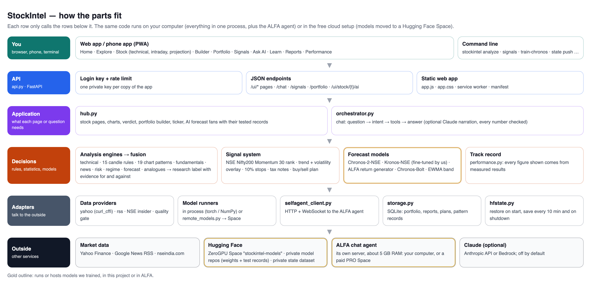
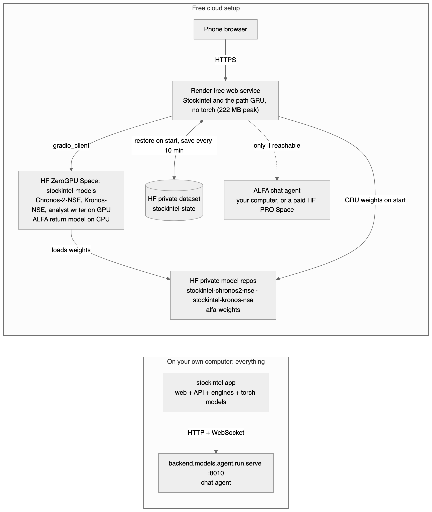
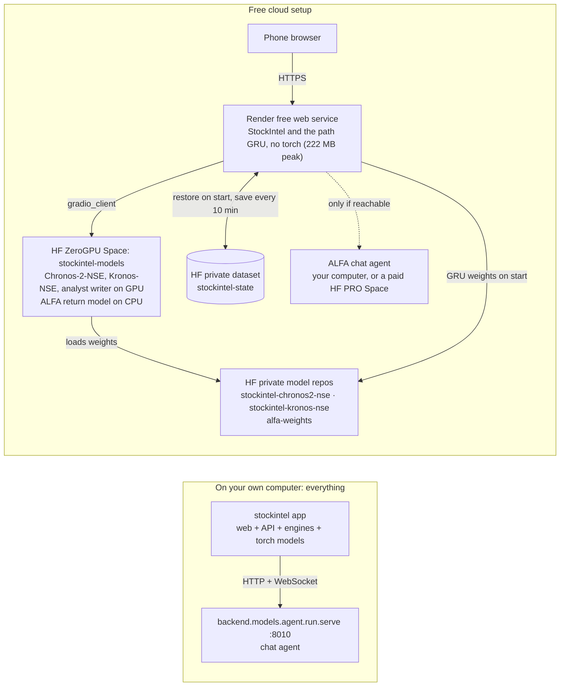
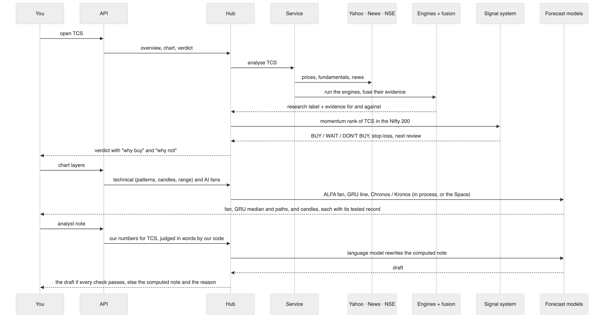
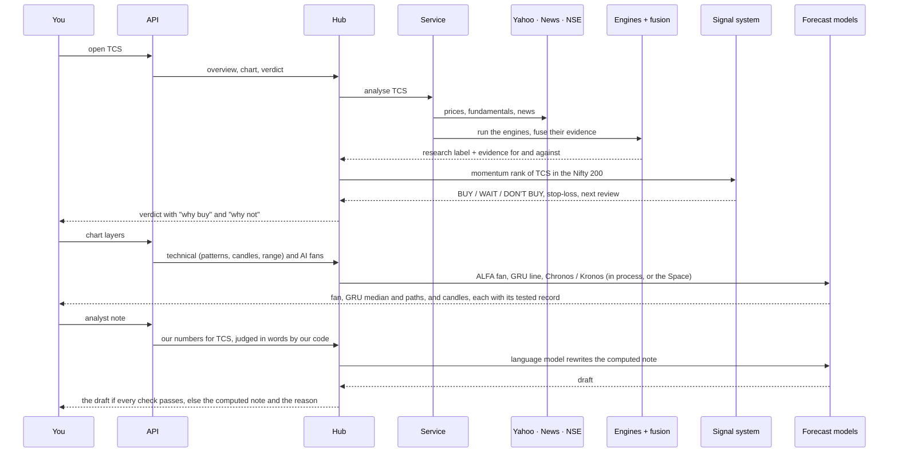
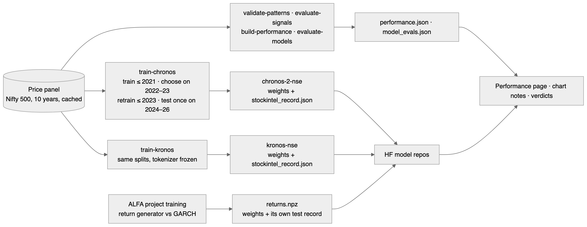
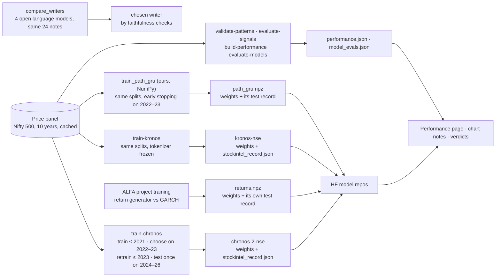
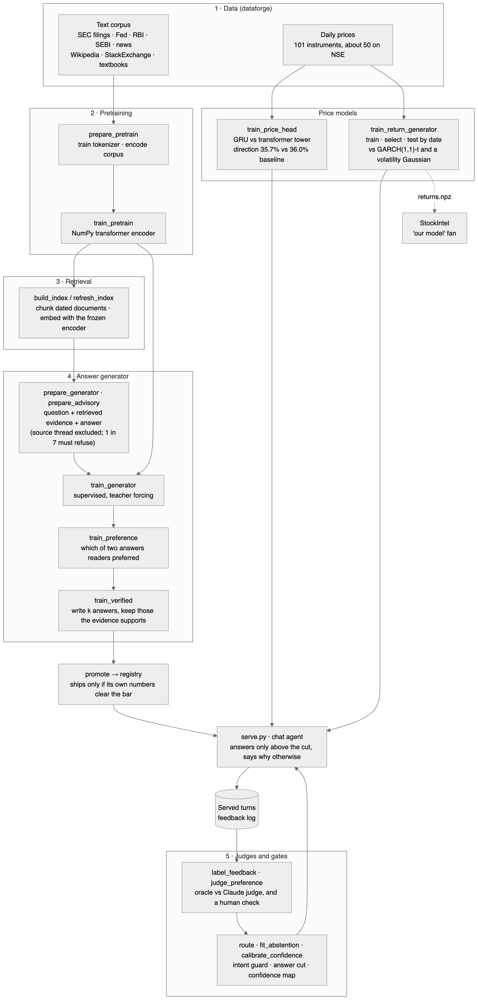
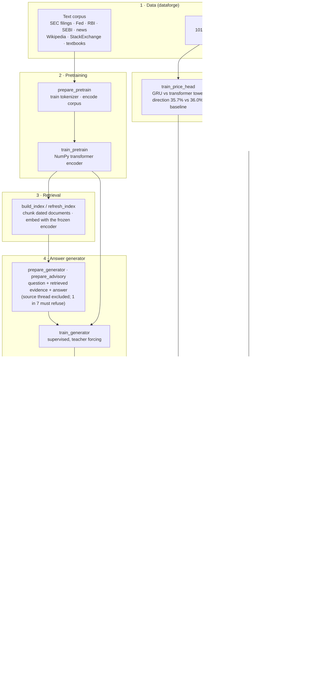

# StockIntel architecture

Four pictures: what the parts are, where they run, what happens when you open a stock, and how
the models are trained and tested. A table of every model follows. Images are in
`docs/architecture/`; each one's source is the Mermaid block under it (the first one's is an HTML file).

## 1. The parts

Source: `architecture/overview.html` (a layered block diagram reads better than an auto-laid-out graph here).

## 2. Where it runs

## 3. Opening a stock: "Should I buy TCS?"

## 4. Training and testing

Every figure the app shows is read from these records; when a record is missing, the app
says so instead of showing a number.

## 5. How ALFA (the other project) is trained

Steps 1–4 teach the agent to answer from evidence. Step 5 decides when it may answer. The loop at
the bottom (served turns → judges → gates) is the self-learning part: judged answers refit the answer
cut, and unjudged ones are stored but do not move it.

## 6. Every model

| Model | What it is | Trained by | Runs | Used for | Measured out of sample |
|---|---|---|---|---|---|
| NSE momentum rank | Nifty200 Momentum 30 formula: z of 12- and 6-month return ÷ 1-year volatility | Formula, not trained | Server | The buy/sell signal | Live ETF beat the Nifty 500 by +1.9 pts/yr (2022–26), unevenly |
| Candle and chart-pattern rules | 15 candle rules, 19 chart-pattern shapes (28 with breakout direction) | Rules | Server | Drawn on charts as context | 0 of 43 show an edge |
| Logistic regression, gradient boosting | scikit-learn direction forecasts | Walk-forward at run time | Server | Research engine | No skill; weight set to 0 |
| EWMA volatility band | Volatility-scaled range | Formula | Server | Grey range on charts | Its 80% band held 77–83% across our tests |
| Chronos-Bolt-small | Amazon time-series model | Amazon (zero-shot) | Server or Space | Optional range layer | Range worse than the band; direction no better than the base rate |
| **Chronos-2-NSE** | AutoGluon Chronos-2-small (28M parameters), fine-tuned on NSE | **Us** | Server or Space | Range layer | Range −4.5% / −0.6% vs band (5 / 20 days); direction 48.9% / 52.0% vs 51.7% / 53.4%. At 10 days: range +0.9%, direction 53.0% vs 50.5% (+0.5 to +4.7 pts grouped by date), tentative because several horizons and models were tried |
| Kronos-small | Candlestick model + tokenizer | NeoQuasar (zero-shot) | Server or Space | Experimental candles | Worse than "no change" (5.2% vs 2.2% error) |
| **Kronos-NSE** | Kronos-small predictor fine-tuned on NSE | **Us** | Server or Space | Experimental candles | Error 4.0% vs 3.3% for "no change" (untuned: 9.7%); direction 48.8% vs 53.2% |
| **Path GRU** | GRU on ALFA's NumPy framework: 60 days in, a mean and spread for each of the next 10 days out | **Us** | Server (NumPy) | Dashed median and thin possible paths beside the median dots | Daily move sizes beat the EWMA band (likelihood +0.019 to +0.058 per day, grouped by date); 10-day error 4.71% vs 4.68% for "no change"; direction 49.5% vs 50.6%, within noise |
| **ALFA return generator** | NumPy transformer, 875,776 parameters | **Us (ALFA)** | Server (local) or Space (CPU) | Gold "our model" fan | Beat GARCH(1,1)-t by 0.032 ± 0.003 nats per return over 80,576 returns; no direction edge |
| GARCH(1,1)-t | Classic volatility model | ALFA, same run | Inside ALFA's loader | Draws the fan if the generator stops beating it | Baseline |
| **ALFA chat agent** | NumPy transformer generator + retrieval index + price head + answer gate | **Us (ALFA)** | Its own server, about 5 GB RAM | "Also ask my self-learning agent" | Answers only above its fitted confidence cut |
| Claude (optional) | Narrator / tool-using agent | Anthropic | Anthropic API or Bedrock | Rewrites answers; every number checked against the evidence | Off by default |
